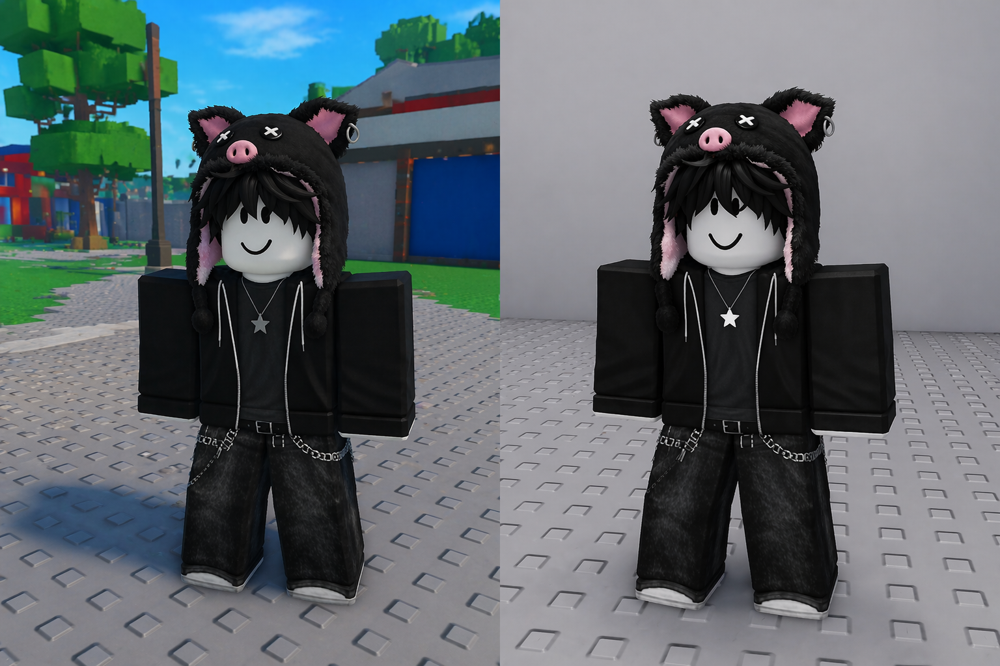

# Marketplace Item Prep Docs

Marketplace Item Prep is a Roblox Studio plugin for faster, cleaner thumbnail prep for Marketplace avatar items.

This repository contains the public documentation for the current `Lite` and `Pro` releases.

## Quick Links

- [Getting Started](docs/getting-started.md)
- [Lite vs Pro](docs/lite-vs-pro.md)
- [Known Limits](docs/known-limits.md)
- [FAQ](docs/faq.md)
- [Changelog](docs/changelog.md)

## Creator Store

- Lite: https://create.roblox.com/store/asset/110282109131622/Marketplace-Item-Prep-Lite
- Pro: https://create.roblox.com/store/asset/113997947078434/Marketplace-Item-Prep-Pro

## What It Helps With

- faster thumbnail prep inside Roblox Studio
- cleaner scene setup through `World Shot` and `Stage Shot`
- quicker framing with presets plus `Frame` and `Reset`
- non-destructive preview workflow during composition
- stronger single-item polish and control in `Pro`

## Public Release Scope

### Lite

`Lite` is the free baseline for fast thumbnail prep.

It includes:

- valid target detection
- `World Shot` and `Stage Shot`
- camera presets
- `Frame` and `Reset`
- basic backdrop and lighting swatches
- stage cleanup and return actions
- last-used settings

### Pro

`Pro` is the single-item quality tier.

It adds:

- `Quick Compose`
- `Fine Tune` camera controls
- full background palette
- advanced lighting controls
- review candidate apply
- `Scene Presets`
- `Safe Framing Guardrail`

## Support

- For plugin support or bug reports, open Marketplace Item Prep in Roblox Studio and use `Help > Contact Support`.
- This repository is for public documentation.
